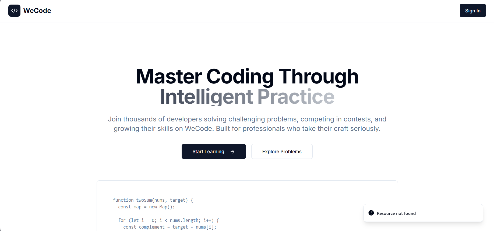
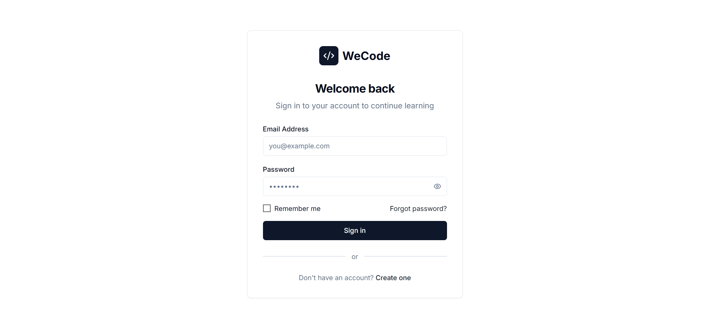
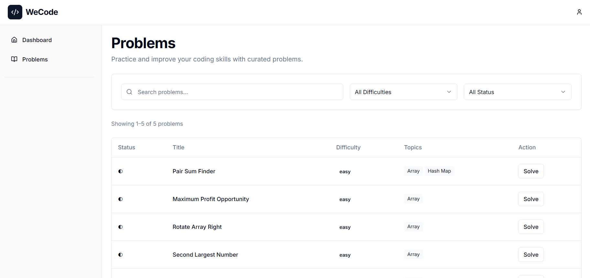
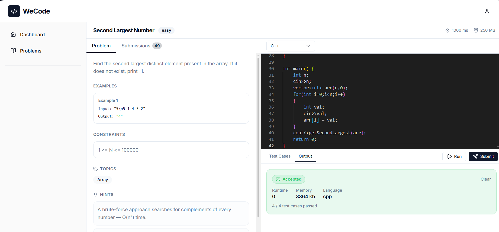
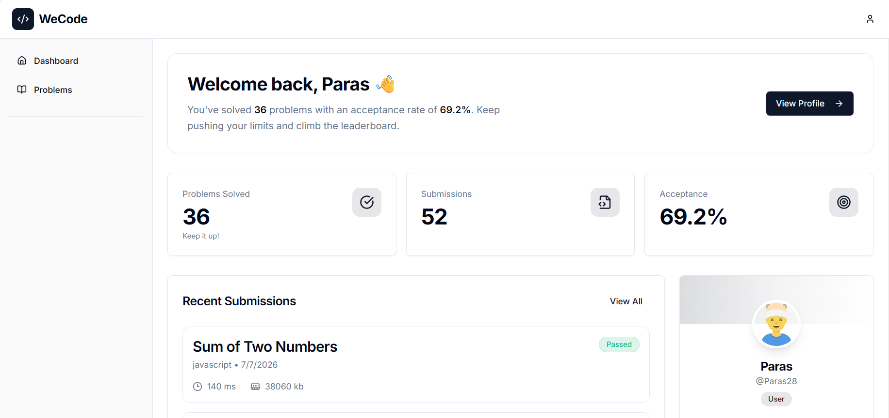

# 🚀 WeCode

> **A Production-Inspired Distributed Online Coding Platform**

**Secure Docker-based Code Execution • BullMQ Job Queue • Redis Pub/Sub
• Socket.IO • AWS Deployment**

------------------------------------------------------------------------

# 📖 Table of Contents

1.  Introduction
2.  Why I Built WeCode
3.  Demo
4.  Features
5.  High Level Architecture
6.  Submission Lifecycle
7.  System Components
8.  Why Distributed Architecture?
9.  Docker Execution Engine
10. BullMQ Queue
11. Redis Pub/Sub
12. Real-time Updates
13. Folder Structure  
14. Engineering Challenges
15. Tech Stack 
17. Environment Variables 
18. Deployment
19. Future Improvements

------------------------------------------------------------------------

# 🎯 Introduction

WeCode is a distributed online coding platform inspired by LeetCode. The
project was built to understand how real coding platforms securely
execute untrusted user code while keeping the application responsive and
scalable.

Instead of executing submissions directly inside the backend API, WeCode
separates responsibilities into independent services.

Core engineering concepts explored:

-   Distributed System Design
-   Background Job Processing
-   Docker-based Sandboxing
-   Redis Pub/Sub Communication
-   Real-time WebSockets
-   Secure Code Execution
-   CI/CD & Cloud Deployment

------------------------------------------------------------------------

# 💡 Why I Built This

Most coding platform clones stop at CRUD operations.

I wanted to go deeper.

Questions I wanted to answer:

-   How does LeetCode safely execute user code?
-   How do long-running submissions avoid blocking the API?
-   How are verdicts delivered instantly?
-   How do services communicate without depending on each other?

This project is my attempt to answer those questions by implementing the
core backend architecture from scratch.

------------------------------------------------------------------------

# 🎥 Demo & Live Preview

## 🎬 Project Demo

📺 **Watch the complete 2-minute walkthrough**

👉 **[Watch Demo on YouTube](https://youtu.be/gRpMz6Erv70)**

---

## 🌐 Live Application

🚀 **Try WeCode Live**

👉 **https://wecodee.duckdns.org**

> **Demo Credentials (if applicable):**
>
> Email: `demo@example.com`
>
> Password: `asdfghjkL`

---

## 📸 Screenshots 

### 🏠 Home Page



---

### 🔐 Login



---

### 💻 Problems



---

### ⚡ Submission Result



---

### 👤 Dashboard


------------------------------------------------------------------------

# ✨ Features

## Authentication

-   JWT Authentication
-   Login / Registration
-   Protected Routes
-   Admin & User Roles

## Problems

-   CRUD Operations
-   Difficulty Levels
-   Tags
-   Hidden Test Cases

## Judge

-   Docker Isolation
-   Multiple Test Cases
-   Runtime Calculation
-   Wrong Answer Detection
-   TLE Detection
-   Compilation Error Detection

## Real Time

-   Socket.IO
-   Redis Pub/Sub
-   Live Verdict Updates

------------------------------------------------------------------------

# 🏗 High Level Architecture

``` text
                 React Frontend
                        │
                        ▼
                Express Backend API
                        │
                        ▼
                    MongoDB
                        │
                        ▼
                 BullMQ Job Queue
                        │
                        ▼
                      Redis
                        │
                        ▼
                 Judge Worker Service
                        │
                        ▼
               Docker Execution Engine
                        │
                        ▼
              Compile & Execute Code
                        │
                        ▼
                  Redis Pub/Sub
                        │
                        ▼
                Backend Subscriber
                        │
                        ▼
                   Socket.IO Server
                        │
                        ▼
                 React Frontend
```

------------------------------------------------------------------------

# 🔄 Submission Lifecycle

## Step 1 --- User submits code

The frontend sends a POST request containing:

-   Source code
-   Language
-   Problem ID

↓

## Step 2 --- Backend validation

The backend:

-   validates JWT
-   validates the problem
-   stores a new submission document

↓

## Step 3 --- Queue Creation

Instead of compiling immediately, the backend pushes a BullMQ job.

Why?

Compilation is expensive.

Keeping it inside the request-response cycle would block the server.

↓

## Step 4 --- Judge Worker and Run Worker

A dedicated Judge Worker continuously listens for new jobs.

As soon as one arrives:

-   fetch submission
-   prepare execution
-   launch Docker

↓

## Step 5 --- Docker Container

Inside Docker:

-   create source file
-   compile
-   execute
-   compare outputs
-   measure runtime

↓

## Step 6 --- Verdict

Judge creates

-   Accepted
-   Wrong Answer
-   Runtime Error
-   Compilation Error
-   Time Limit Exceeded

↓

## Step 7 --- Redis

Judge publishes result.

It never directly calls the backend.

↓

## Step 8 --- Backend Subscriber

Backend receives the Redis event.

Updates MongoDB.

↓

## Step 9 --- Socket.IO

Backend emits event to frontend.

↓

## Step 10 --- User

Verdict appears instantly without refreshing.

------------------------------------------------------------------------

# ⚙ Why Distributed Architecture?

## Traditional Approach

``` text
Client
   │
Backend
   │
Compile
   │
Execute
```

Problems:

-   Slow API
-   Request blocking
-   Poor scalability

------------------------------------------------------------------------

## WeCode Approach

``` text
Client
   │
Backend
   │
Queue
   │
Judge Worker
   │
Docker
```

Benefits:

-   Fast API responses
-   Independent scaling
-   Fault isolation

------------------------------------------------------------------------

# 🐳 Docker Execution

Running arbitrary code directly on the server is dangerous.

Every submission executes inside an isolated Docker container.

Benefits:

-   Filesystem isolation
-   Process isolation
-   Easy cleanup
-   Safer execution

Execution Flow:

``` text
Submission

↓

Temporary Container

↓

Compile

↓

Execute

↓

Destroy Container
```

------------------------------------------------------------------------

# 📬 BullMQ

BullMQ acts as the producer-consumer queue.

Backend:

Producer

Judge:

Consumer

Advantages:

-   Background processing
-   Retries
-   Scalability
-   Decoupling

------------------------------------------------------------------------

# 📡 Redis Pub/Sub

Instead of

Judge → HTTP → Backend

We use

Judge → Redis → Backend

Advantages:

-   Loose coupling
-   Event-driven communication
-   Easy scaling

------------------------------------------------------------------------

# ⚡ Socket.IO

Polling wastes resources.

Instead:

Judge finishes

↓

Redis

↓

Backend

↓

Socket.IO

↓

Frontend

Instant verdict.

------------------------------------------------------------------------

# 📂 Folder Structure

``` text
frontend/
    components/
    pages/
    hooks/

backend/
    controllers/
    middleware/
    routes/
    services/
    models/
    socket/

judge-service/
    workers/
    compiler/
    docker/
    queues/
```

Each module has a single responsibility, making the project easier to
maintain and extend.

------------------------------------------------------------------------

# 🧠 Engineering Challenges

## Challenge 1

### Problem

Executing user code safely.

### Solution

Docker sandbox.

------------------------------------------------------------------------

## Challenge 2

### Problem

Long-running compilation blocks backend.

### Solution

BullMQ background workers.

------------------------------------------------------------------------

## Challenge 3

### Problem

Need instant verdicts.

### Solution

Redis Pub/Sub + Socket.IO.

------------------------------------------------------------------------

## Challenge 4

### Problem

Judge and backend should remain independent.

### Solution

Asynchronous event-driven architecture.

------------------------------------------------------------------------

# 🛠 Tech Stack

Frontend: - React - TypeScript - Tailwind CSS

Backend: - Node.js - Express - JWT

Database: - MongoDB

Infrastructure: - Docker - Redis - BullMQ - Socket.IO

Deployment: - AWS EC2 - GitHub Actions - Nginx

------------------------------------------------------------------------

# 🚀 Local Setup

## Prerequisites

Make sure you have the following installed:

- Docker
- Docker Compose
- Git

Verify your installation:

```bash
docker --version
docker compose version
```

---

## Clone the Repository

```bash
git clone https://github.com/paras027/WeCode.git

cd WeCode
```

---

## Configure Environment Variables

Create the required `.env` files.

### Backend

```bash
cp backend/.env.example backend/.env
```

### Frontend

```bash
cp frontend/.env.example frontend/.env
```

### Judge Service

```bash
cp judge-service/.env.example judge-service/.env
```

Update the environment variables as required.

---

## Start the Entire Application

```bash
docker compose up --build
```

This command starts:

- React Frontend
- Express Backend
- MongoDB
- Redis
- Judge Service

---

## Stop the Application

```bash
docker compose down
```

---

## Rebuild Containers

```bash
docker compose up --build
```

---

## View Logs

```bash
docker compose logs -f
```
------------------------------------------------------------------------

# 🔐 Environment Variables

Backend

``` env.production
PORT= 
MONGO_URI= 
NODE_ENV= 
JWT_SECRET=
JWT_REFRESH_SECRET= 
JWT_EXPIRES_IN=
RESEND_API_KEY=
REDIS_HOST=
REDIS_PORT =
```

Frontend

``` env.production
VITE_API_URL=
```

Judge

``` env.production
PORT =
MONGO_URI=
NODE_ENV=
REDIS_HOST=
REDIS_PORT=
WORKSPACE_PATH=
CONTAINER_WORKSPACE=
```

------------------------------------------------------------------------

# ☁ Deployment

-   Dockerized Services
-   GitHub Actions
-   AWS EC2
-   Nginx Reverse Proxy

------------------------------------------------------------------------

# 🛣 Future Improvements

-   Contest Mode
-   Leaderboards
-   Custom Test Cases
-   AI Code Review
-   Kubernetes
-   Horizontal Judge Scaling
-   Metrics & Monitoring

------------------------------------------------------------------------

# 👨‍💻 Author

**Paras Sharma**

Backend & MERN Developer

If this repository helped you, consider giving it a ⭐.
